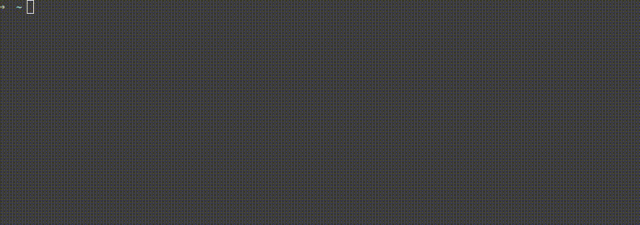
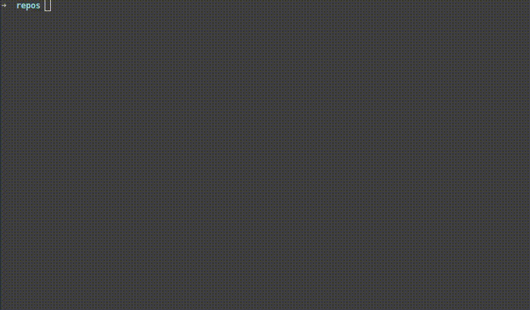
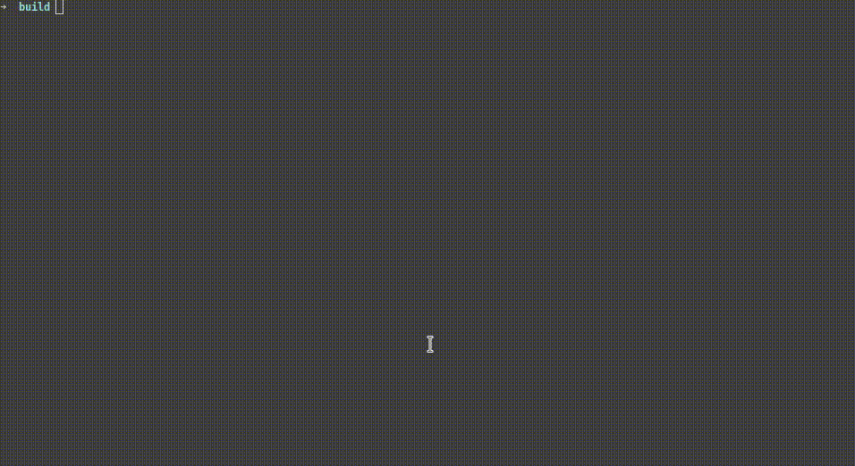

# Base Development Docker

It is a base docker for the out-of-box development, mainly for C++ and Python.

Pull command:

```bash
docker pull ai-image.jd.com/dockers-for-development/base:replace_me_with_the_latest_version
```

The latest version can be found at [here](http://ai-image.jd.com/harbor/projects/169/repositories/dockers-for-development%2Fbase).

## Basic Info

OS: Ubuntu 16.04

C++ toolchain: gcc 5.4.0 (default, shipped with Ubuntu 16.04) and clang 8.0.1 (latest clang, C++17 support)

CMake: 3.14.4

Python: 3.5

## Shell Configuration

zsh 5.1.1

Powerful highlighting and completion


Tab completions is case- and HYPHEN- insensitive.



Commands are suggested as you type based on history and completions. Press ctrl-f to complete the command and press ctrl-j to complete and run the command.



Press ctrl-r to get history commands and search them fuzzily.



## Vim Configuration

### Keymaps

* Jump to definition: ,jd

* Jump to implementation: ,ji

* Find references: ,jf

* Rename: ,jj

* Format current file: `:Format`

* Fuzzy search in files: ,f

* Fuzzy search in opened buffers: ,b

* Search text in all files: `:Ag`

* Jump to next placeholder in a snippet: ctrl-j

* Jump to previous placeholder in a snippet: ctrl-k

* List all symbols (like JetBrains IDEs): space-s

### Text Objects

Two new text objects: "a" for arguments and "f" for functions.

For example, `dia` deletes the arguments under the cursor, `vaa` selects the arguments under the cursor including the comma, `dif` deletes the content of current function.

### C++

C++ diagnostics and completions (based on semantics) work out-of-box. A `compile_commands.json` is needed to provide accurate compile options, please check out https://clang.llvm.org/extra/clangd/Installation.html#compile-commands-json.

In a git repository, `install-clangformat-hook` will install a git pre-commit hook that run clang-format on every git commit.


### Python

Python Language Server will be downloaded automatically when opening a .py file. The diagnostics and completions will work as soon as the language server is downloaded.

## Aliases

* vim    -> nvim

* top    -> htop

* fk     -> fuck

* git st -> git status

* git ci -> git commit

* git co -> git checkout

* git br -> git branch

* git cp -> git cherry-pick

## Other tools

* tmux (with https://github.com/gpakosz/.tmux)

* gtags

* ctags

* htop (aliased to top)

* ag

* fzf
