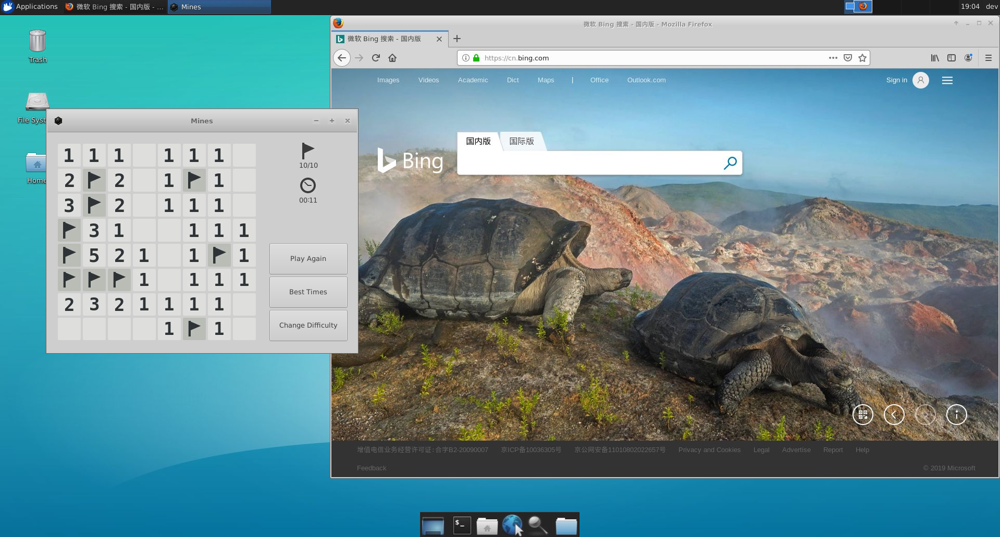

# X2GO Docker

This docker is based on the base docker, and equipped with [x2go](https://wiki.x2go.org/doku.php)

This docker aims to run desktop environment and GUI programms on servers.

The following whole desktop environment is running on a server:



## Usage

1. Pull this docker on your server

2. Start the docker

    ```bash
    docker run -d -p replace_me_with_port:22 ai-image.jd.com/dockers-for-development/x2go:replace_me_with_the_latest_version
    ```

    Add `--runtime=nvidia` after `docker run` if you need gpu support.

    The latest version can be found at [here](http://ai-image.jd.com/harbor/projects/169/repositories/dockers-for-development%2Fx2go).

3. Install x2go client on your PC.

4. Connect to server_ip:port as user "dev", set session type as XFCE

5. Enjoy the desktop environment running on your server!
